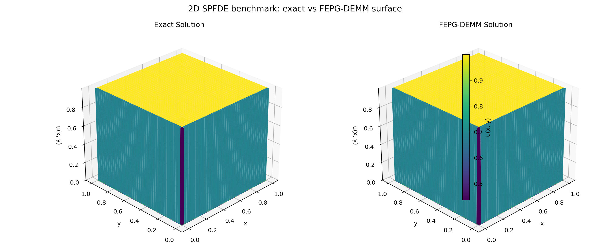
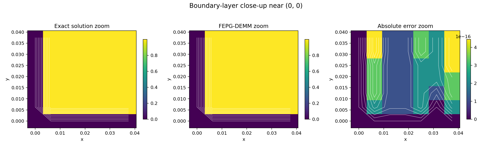
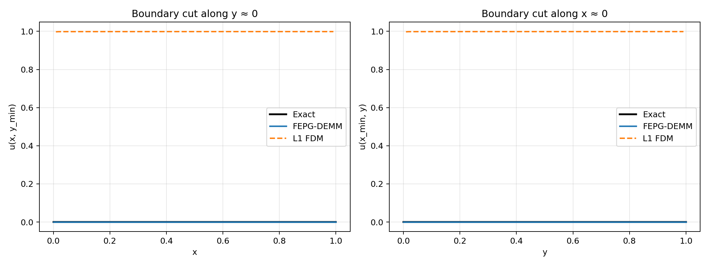
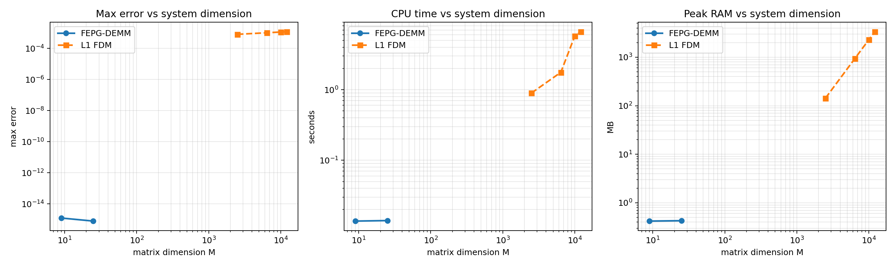

# 2D SPFDE Benchmark Report

## Problem

Equation: `\epsilon (D_x^\alpha u + D_y^\alpha u) + u = f` on the interior tensor grid of `(0,1) x (0,1)`.

Manufactured solution: `u_{exact}(x,y) = (1 - \Psi(x))(1 - \Psi(y))`, with `\Psi(z) = E_\alpha(-z^\alpha / \epsilon)`.

Forcing: `f(x,y) = 1 - \Psi(x)\Psi(y)`.

## Configuration

- `alpha = 0.5`
- `epsilon = 1.0e-04`
- `FEPG-DEMM n_basis in [3, 5]`
- `L1 FDM n_nodes in [50, 80, 100, 110]`
- `dense_points = 161`

## Executive Summary

- Maximum observed peak RAM for dense 2D L1 FDM: `3351.25 MB`.
- Maximum observed peak RAM for 2D FEPG-DEMM: `0.43 MB`.
- Largest observed RAM ratio `RAM(FDM) / RAM(FEPG)` over the sweep: `7.990e+03`.
- Largest observed runtime ratio `time(FDM) / time(FEPG)` over the sweep: `4.821e+02`.

## Result Table

| method | requested | actual | matrix size | max error | cpu time (s) | peak RAM (MB) | note |
|---|---:|---:|---:|---:|---:|---:|---|
| 2D FEPG-DEMM | 3 | 3 | 9 x 9 | 1.22125e-15 | 1.37495e-02 | 0.42 | - |
| 2D FEPG-DEMM | 5 | 5 | 25 x 25 | 7.77156e-16 | 1.39748e-02 | 0.43 | - |
| 2D L1 FDM | 50 | 50 | 2500 x 2500 | 8.03555e-04 | 8.95634e-01 | 143.09 | - |
| 2D L1 FDM | 80 | 80 | 6400 x 6400 | 1.01194e-03 | 1.75949e+00 | 937.60 | - |
| 2D L1 FDM | 100 | 100 | 10000 x 10000 | 1.12952e-03 | 5.74685e+00 | 2288.97 | - |
| 2D L1 FDM | 110 | 110 | 12100 x 12100 | 1.18389e-03 | 6.62863e+00 | 3351.25 | - |

Raw CSV: [benchmark_2d_heavy_results.csv](benchmark_2d_heavy_results.csv)

## 3D Surface Plot

## Boundary-Layer Corner Zoom

## Boundary Cuts Near x = 0 and y = 0

## Performance Metrics

