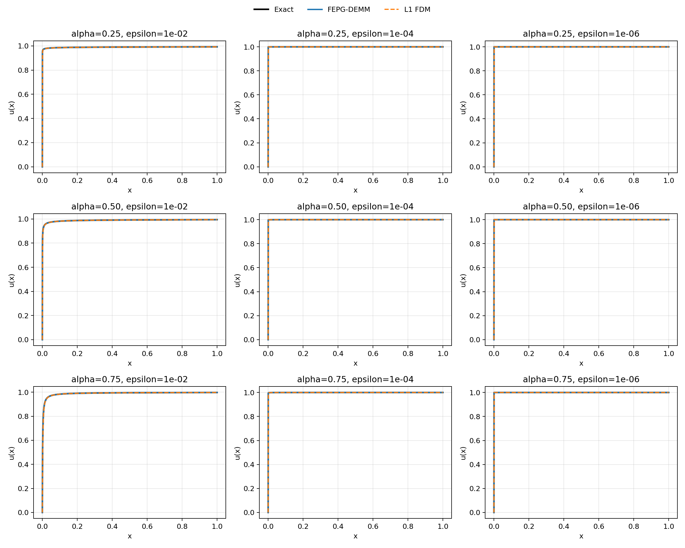
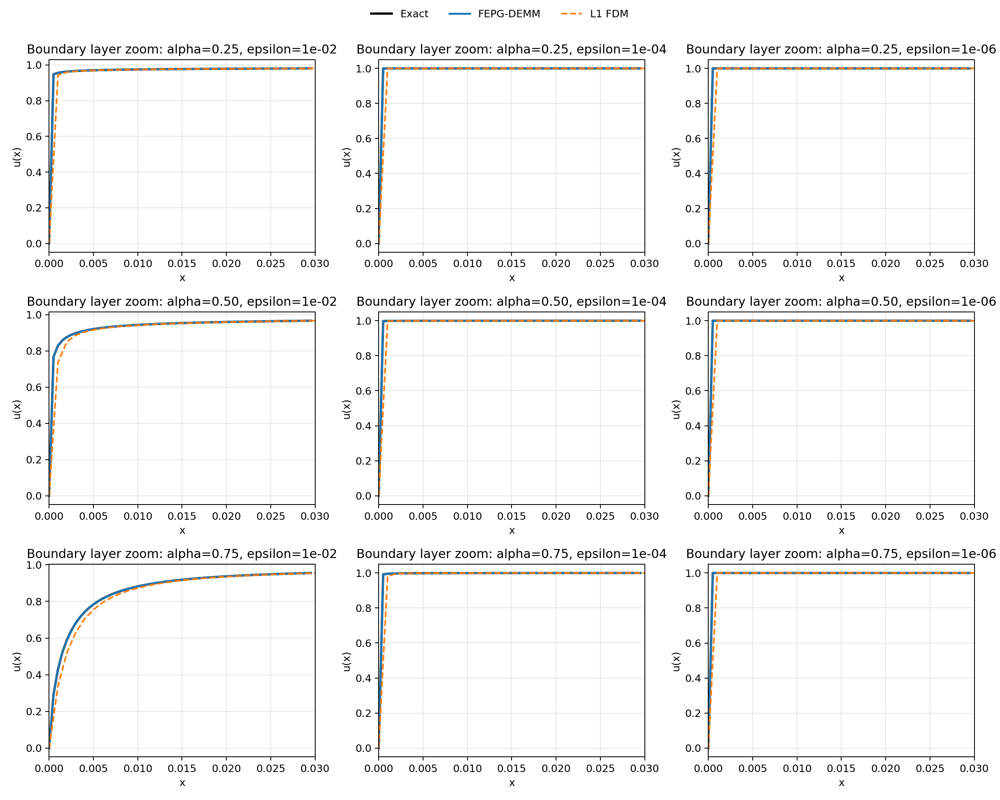
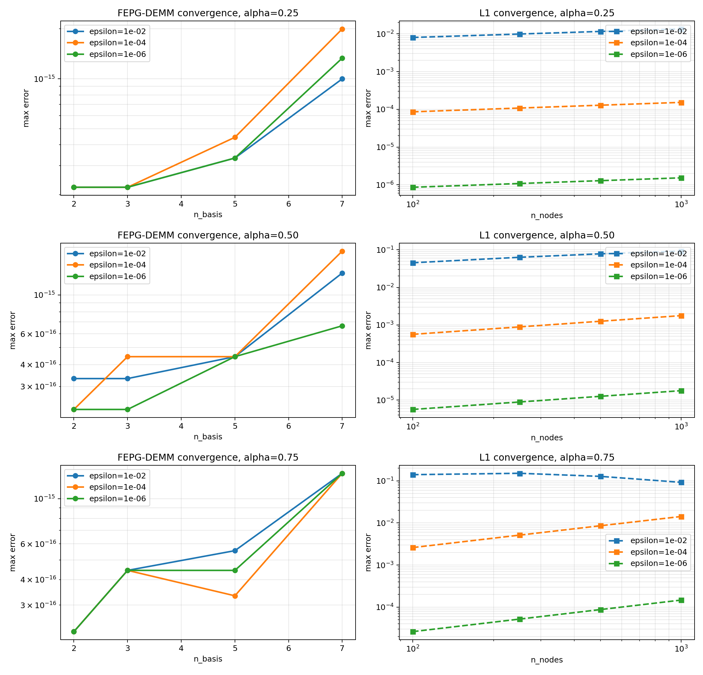
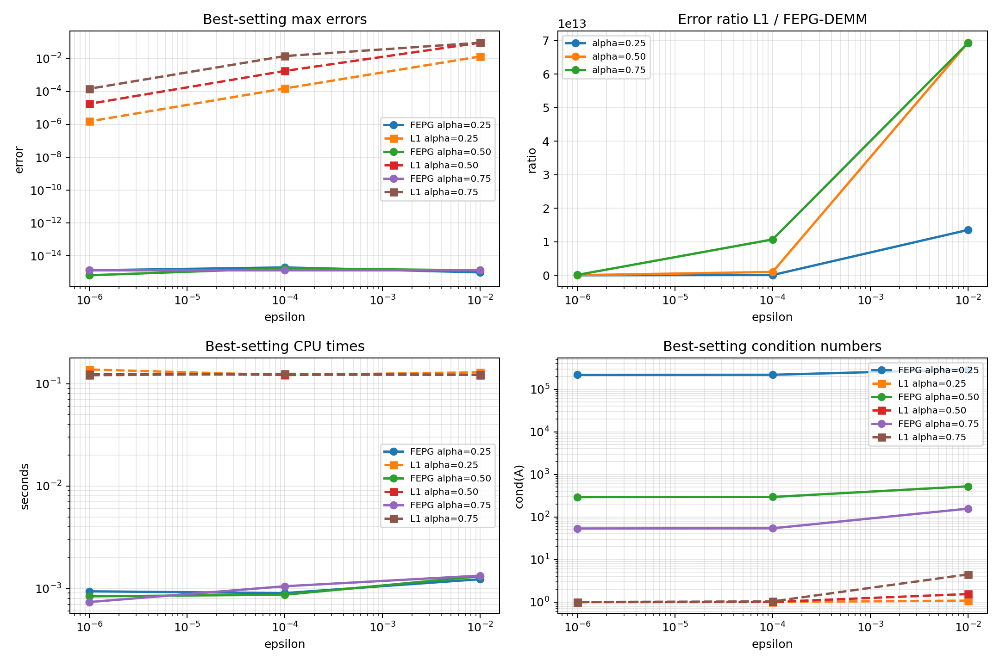

# SPFDE Large-Scale Benchmark Report

## Problem

Benchmark equation: `\epsilon D_C^\alpha u(x) + u(x) = 1`, `x \in (0,1]`, with `u(0)=0`.

Exact solution: `u(x) = 1 - E_\alpha(-x^\alpha / \epsilon)`.

## Sweep Configuration

- `alpha in ['0.25', '0.50', '0.75']`
- `epsilon in [1e-02, 1e-04, 1e-06]`
- `FEPG-DEMM n_basis in [2, 3, 5, 7]`
- `L1 n_nodes in [100, 250, 500, 1000]`
- `dense_points = 2000`

## Executive Summary

- Total runs: `36` FEPG-DEMM cases and `36` L1 cases.
- Largest FEPG-DEMM max error over the full sweep: `1.99840e-15`.
- Largest L1 max error over the full sweep: `1.51423e-01`.
- Largest observed accuracy gain `error(L1) / error(FEPG-DEMM)` in the best-vs-best comparison: `6.93610e+13`.
- Largest observed runtime ratio `time(L1) / time(FEPG-DEMM)` in the best-vs-best comparison: `1.63987e+02`.
- Largest observed FEPG-DEMM condition number: `2.91443e+05`.
- Largest observed L1 condition number: `4.46641e+00`.

## Best-vs-Best Comparison

| alpha | epsilon | FEPG n_basis | L1 n_nodes | FEPG error | L1 error | L1/FEPG | FEPG cond | FEPG precond cond | L1 cond | FEPG time (s) | L1 time (s) |
| ---: | ---: | ---: | ---: | ---: | ---: | ---: | ---: | ---: | ---: | ---: | ---: |
| 0.75 | 1.0e-02 | 7 | 1000 | 1.33227e-15 | 9.23211e-02 | 6.92962e+13 | 1.56292e+02 | 2.62430e+01 | 4.46641e+00 | 1.33440e-03 | 1.21890e-01 |
| 0.75 | 1.0e-04 | 7 | 1000 | 1.33227e-15 | 1.42462e-02 | 1.06932e+13 | 5.40218e+01 | 1.67701e+01 | 1.03466e+00 | 1.05130e-03 | 1.24736e-01 |
| 0.75 | 1.0e-06 | 7 | 1000 | 1.33227e-15 | 1.47096e-04 | 1.10410e+11 | 5.34229e+01 | 1.67067e+01 | 1.00035e+00 | 7.37200e-04 | 1.20891e-01 |
| 0.50 | 1.0e-02 | 7 | 1000 | 1.33227e-15 | 9.24075e-02 | 6.93610e+13 | 5.22831e+02 | 4.61488e+01 | 1.54252e+00 | 1.31570e-03 | 1.22084e-01 |
| 0.50 | 1.0e-04 | 7 | 1000 | 1.77636e-15 | 1.77145e-03 | 9.97235e+11 | 2.94372e+02 | 3.45319e+01 | 1.00543e+00 | 8.69500e-04 | 1.22252e-01 |
| 0.50 | 1.0e-06 | 7 | 1000 | 6.66134e-16 | 1.78400e-05 | 2.67814e+10 | 2.92608e+02 | 3.44268e+01 | 1.00005e+00 | 8.37800e-04 | 1.24062e-01 |
| 0.25 | 1.0e-02 | 7 | 1000 | 9.99201e-16 | 1.35050e-02 | 1.35158e+13 | 2.91443e+05 | 1.07454e+03 | 1.07731e+00 | 1.23140e-03 | 1.29283e-01 |
| 0.25 | 1.0e-04 | 7 | 1000 | 1.99840e-15 | 1.52770e-04 | 7.64462e+10 | 2.18557e+05 | 9.30519e+02 | 1.00077e+00 | 9.01500e-04 | 1.21211e-01 |
| 0.25 | 1.0e-06 | 7 | 1000 | 1.33227e-15 | 1.52964e-06 | 1.14815e+09 | 2.17918e+05 | 9.29159e+02 | 1.00001e+00 | 9.37900e-04 | 1.37618e-01 |

Best-comparison CSV:
[benchmark_best_comparison.csv](benchmark_best_comparison.csv)

## Full FEPG-DEMM Sweep Tables

### FEPG-DEMM results for alpha = 0.25

| epsilon | n_basis | max error | cond | raw cond | precond cond | cpu time (s) |
| ---: | ---: | ---: | ---: | ---: | ---: | ---: |
| 1.0e-02 | 7 | 9.99201e-16 | 2.91443e+05 | 8.34920e+05 | 1.07454e+03 | 1.23140e-03 |
| 1.0e-02 | 5 | 3.33067e-16 | 1.84845e+04 | 7.40743e+03 | 2.78616e+02 | 1.12180e-03 |
| 1.0e-02 | 3 | 2.22045e-16 | 1.27524e+03 | 2.09157e+02 | 7.26787e+01 | 9.33500e-04 |
| 1.0e-02 | 2 | 2.22045e-16 | 1.73990e+02 | 3.51168e+01 | 2.77792e+01 | 1.10680e-03 |
| 1.0e-04 | 7 | 1.99840e-15 | 2.18557e+05 | 8.19742e+05 | 9.30519e+02 | 9.01500e-04 |
| 1.0e-04 | 5 | 4.44089e-16 | 1.58134e+04 | 7.34840e+03 | 2.57793e+02 | 7.50900e-04 |
| 1.0e-04 | 3 | 2.22045e-16 | 1.21989e+03 | 2.07528e+02 | 7.11340e+01 | 6.22000e-04 |
| 1.0e-04 | 2 | 2.22045e-16 | 1.71390e+02 | 3.49354e+01 | 2.75290e+01 | 7.35400e-04 |
| 1.0e-06 | 7 | 1.33227e-15 | 2.17918e+05 | 8.19592e+05 | 9.29159e+02 | 9.37900e-04 |
| 1.0e-06 | 5 | 3.33067e-16 | 1.57884e+04 | 7.34781e+03 | 2.57590e+02 | 6.89900e-04 |
| 1.0e-06 | 3 | 2.22045e-16 | 1.21935e+03 | 2.07512e+02 | 7.11187e+01 | 5.55100e-04 |
| 1.0e-06 | 2 | 2.22045e-16 | 1.71364e+02 | 3.49336e+01 | 2.75265e+01 | 5.60400e-04 |

### FEPG-DEMM results for alpha = 0.50

| epsilon | n_basis | max error | cond | raw cond | precond cond | cpu time (s) |
| ---: | ---: | ---: | ---: | ---: | ---: | ---: |
| 1.0e-02 | 7 | 1.33227e-15 | 5.22831e+02 | 1.69936e+05 | 4.61488e+01 | 1.31570e-03 |
| 1.0e-02 | 5 | 4.44089e-16 | 2.47232e+02 | 3.35643e+03 | 3.17014e+01 | 1.06210e-03 |
| 1.0e-02 | 3 | 3.33067e-16 | 4.99448e+02 | 1.74824e+02 | 4.26763e+01 | 8.94300e-04 |
| 1.0e-02 | 2 | 3.33067e-16 | 8.43524e+01 | 2.45685e+01 | 1.61247e+01 | 9.87700e-04 |
| 1.0e-04 | 7 | 1.77636e-15 | 2.94372e+02 | 1.65674e+05 | 3.45319e+01 | 8.69500e-04 |
| 1.0e-04 | 5 | 4.44089e-16 | 1.81719e+02 | 3.32257e+03 | 2.70723e+01 | 7.59400e-04 |
| 1.0e-04 | 3 | 4.44089e-16 | 4.77713e+02 | 1.73389e+02 | 4.19830e+01 | 6.19400e-04 |
| 1.0e-04 | 2 | 2.22045e-16 | 8.31721e+01 | 2.44634e+01 | 1.59586e+01 | 7.94600e-04 |
| 1.0e-06 | 7 | 6.66134e-16 | 2.92608e+02 | 1.65632e+05 | 3.44268e+01 | 8.37800e-04 |
| 1.0e-06 | 5 | 4.44089e-16 | 1.81148e+02 | 3.32223e+03 | 2.70285e+01 | 6.66400e-04 |
| 1.0e-06 | 3 | 2.22045e-16 | 4.77500e+02 | 1.73375e+02 | 4.19762e+01 | 5.01600e-04 |
| 1.0e-06 | 2 | 2.22045e-16 | 8.31604e+01 | 2.44623e+01 | 1.59569e+01 | 6.49100e-04 |

### FEPG-DEMM results for alpha = 0.75

| epsilon | n_basis | max error | cond | raw cond | precond cond | cpu time (s) |
| ---: | ---: | ---: | ---: | ---: | ---: | ---: |
| 1.0e-02 | 7 | 1.33227e-15 | 1.56292e+02 | 2.20305e+05 | 2.62430e+01 | 1.33440e-03 |
| 1.0e-02 | 5 | 5.55112e-16 | 7.98026e+01 | 5.23941e+03 | 1.54726e+01 | 1.08900e-03 |
| 1.0e-02 | 3 | 4.44089e-16 | 6.23061e+02 | 3.03638e+02 | 4.08702e+01 | 8.29100e-04 |
| 1.0e-02 | 2 | 2.22045e-16 | 6.06260e+01 | 2.10561e+01 | 1.06638e+01 | 8.76500e-04 |
| 1.0e-04 | 7 | 1.33227e-15 | 5.40218e+01 | 2.11574e+05 | 1.67701e+01 | 1.05130e-03 |
| 1.0e-04 | 5 | 3.33067e-16 | 6.95450e+01 | 5.16181e+03 | 1.49229e+01 | 8.53300e-04 |
| 1.0e-04 | 3 | 4.44089e-16 | 5.93234e+02 | 3.00759e+02 | 4.03340e+01 | 7.49400e-04 |
| 1.0e-04 | 2 | 2.22045e-16 | 5.97251e+01 | 2.09774e+01 | 1.05199e+01 | 1.50346e-02 |
| 1.0e-06 | 7 | 1.33227e-15 | 5.34229e+01 | 2.11489e+05 | 1.67067e+01 | 7.37200e-04 |
| 1.0e-06 | 5 | 4.44089e-16 | 6.94940e+01 | 5.16105e+03 | 1.49311e+01 | 6.19400e-04 |
| 1.0e-06 | 3 | 4.44089e-16 | 5.92943e+02 | 3.00731e+02 | 4.03288e+01 | 6.41000e-04 |
| 1.0e-06 | 2 | 2.22045e-16 | 5.97162e+01 | 2.09766e+01 | 1.05184e+01 | 7.10000e-04 |

Full FEPG-DEMM CSV:
[benchmark_fepg_sweep.csv](benchmark_fepg_sweep.csv)

## Full L1 Sweep Tables

### L1 FDM results for alpha = 0.25

| epsilon | n_nodes | max error | cond | cpu time (s) |
| ---: | ---: | ---: | ---: | ---: |
| 1.0e-02 | 1000 | 1.35050e-02 | 1.07731e+00 | 1.29283e-01 |
| 1.0e-02 | 500 | 1.15776e-02 | 1.06501e+00 | 3.00364e-02 |
| 1.0e-02 | 250 | 9.89681e-03 | 1.05467e+00 | 8.93050e-03 |
| 1.0e-02 | 100 | 8.01288e-03 | 1.04347e+00 | 1.55360e-03 |
| 1.0e-04 | 1000 | 1.52770e-04 | 1.00077e+00 | 1.21211e-01 |
| 1.0e-04 | 500 | 1.28490e-04 | 1.00065e+00 | 3.04754e-02 |
| 1.0e-04 | 250 | 1.08065e-04 | 1.00055e+00 | 8.04250e-03 |
| 1.0e-04 | 100 | 8.59572e-05 | 1.00043e+00 | 1.20760e-03 |
| 1.0e-06 | 1000 | 1.52964e-06 | 1.00001e+00 | 1.37618e-01 |
| 1.0e-06 | 500 | 1.28627e-06 | 1.00001e+00 | 3.12635e-02 |
| 1.0e-06 | 250 | 1.08162e-06 | 1.00001e+00 | 8.54560e-03 |
| 1.0e-06 | 100 | 8.60185e-07 | 1.00000e+00 | 1.27590e-03 |

### L1 FDM results for alpha = 0.50

| epsilon | n_nodes | max error | cond | cpu time (s) |
| ---: | ---: | ---: | ---: | ---: |
| 1.0e-02 | 1000 | 9.24075e-02 | 1.54252e+00 | 1.22084e-01 |
| 1.0e-02 | 500 | 7.82638e-02 | 1.38362e+00 | 3.09100e-02 |
| 1.0e-02 | 250 | 6.32701e-02 | 1.27126e+00 | 7.76800e-03 |
| 1.0e-02 | 100 | 4.52555e-02 | 1.17154e+00 | 1.27090e-03 |
| 1.0e-04 | 1000 | 1.77145e-03 | 1.00543e+00 | 1.22252e-01 |
| 1.0e-04 | 500 | 1.25522e-03 | 1.00384e+00 | 2.91931e-02 |
| 1.0e-04 | 250 | 8.88886e-04 | 1.00271e+00 | 8.01020e-03 |
| 1.0e-04 | 100 | 5.62918e-04 | 1.00172e+00 | 1.25370e-03 |
| 1.0e-06 | 1000 | 1.78400e-05 | 1.00005e+00 | 1.24062e-01 |
| 1.0e-06 | 500 | 1.26150e-05 | 1.00004e+00 | 2.95073e-02 |
| 1.0e-06 | 250 | 8.92030e-06 | 1.00003e+00 | 8.46680e-03 |
| 1.0e-06 | 100 | 5.64177e-06 | 1.00002e+00 | 1.29400e-03 |

### L1 FDM results for alpha = 0.75

| epsilon | n_nodes | max error | cond | cpu time (s) |
| ---: | ---: | ---: | ---: | ---: |
| 1.0e-02 | 1000 | 9.23211e-02 | 4.46641e+00 | 1.21890e-01 |
| 1.0e-02 | 500 | 1.28000e-01 | 3.06113e+00 | 2.95257e-02 |
| 1.0e-02 | 250 | 1.51423e-01 | 2.22553e+00 | 8.41400e-03 |
| 1.0e-02 | 100 | 1.40546e-01 | 1.61633e+00 | 1.26970e-03 |
| 1.0e-04 | 1000 | 1.42462e-02 | 1.03466e+00 | 1.24736e-01 |
| 1.0e-04 | 500 | 8.58283e-03 | 1.02061e+00 | 3.00379e-02 |
| 1.0e-04 | 250 | 5.14330e-03 | 1.01226e+00 | 7.57310e-03 |
| 1.0e-04 | 100 | 2.60166e-03 | 1.00616e+00 | 1.49740e-03 |
| 1.0e-06 | 1000 | 1.47096e-04 | 1.00035e+00 | 1.20891e-01 |
| 1.0e-06 | 500 | 8.74751e-05 | 1.00021e+00 | 3.29771e-02 |
| 1.0e-06 | 250 | 5.20170e-05 | 1.00012e+00 | 8.38790e-03 |
| 1.0e-06 | 100 | 2.61647e-05 | 1.00006e+00 | 1.28720e-03 |

Full L1 CSV:
[benchmark_fdm_sweep.csv](benchmark_fdm_sweep.csv)

## Solution Profiles on [0, 1]

## Boundary-Layer Close-Up Near x = 0

Zoom window rule: `x in [0, min(0.1, max(12 * epsilon^(1/alpha), 30 / N_max))]`, where `N_max` is the finest L1 grid size.

## Convergence Trends Across Discretizations

## Best-Setting Metrics

