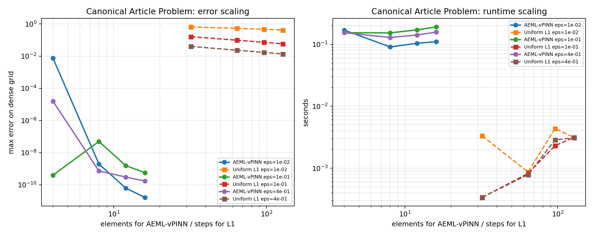
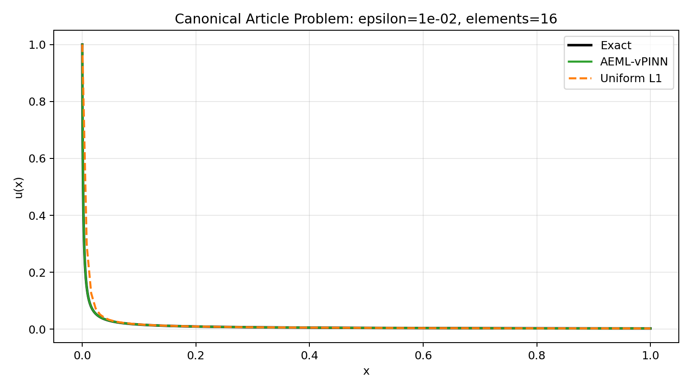

# AEML-vPINN Benchmark: Canonical Article Problem

## Configuration

- `alpha = 0.75`
- `epsilons = ['1.0e-02', '1.0e-01', '4.0e-01']`
- `element counts = [4, 8, 12, 16]`
- `quadrature order = 8`
- `dense_points = 3000`

`epsilon D_C^alpha u(x) + u(x) = 0`, `u(0)=1`, with exact solution `u(x)=E_alpha(-x^alpha / epsilon)`.

## AEML-vPINN Error Table

| n_elements | eps=1.0e-02 | eps=1.0e-01 | eps=4.0e-01 |
| ---: | ---: | ---: | ---: |
| 4 | 7.50024e-03 | 3.99537e-10 | 1.59715e-05 |
| 8 | 1.96850e-09 | 4.96202e-08 | 7.24638e-10 |
| 12 | 6.24665e-11 | 1.56123e-09 | 3.04379e-10 |
| 16 | 1.65403e-11 | 5.69523e-10 | 1.72158e-10 |

Raw CSV: [canonical_aeml_vpinn_sweep.csv](canonical_aeml_vpinn_sweep.csv)

## Uniform L1 Reference CSV

[canonical_uniform_l1_reference_sweep.csv](canonical_uniform_l1_reference_sweep.csv)

## Best AEML-vPINN Per Epsilon

| epsilon | best elements | node count | max error | weak loss | time (s) |
| ---: | ---: | ---: | ---: | ---: | ---: |
| 1.0e-02 | 16 | 128 | 1.65403e-11 | 2.43090e-15 | 1.10516e-01 |
| 1.0e-01 | 4 | 32 | 3.99537e-10 | 1.22003e-11 | 1.54053e-01 |
| 4.0e-01 | 16 | 128 | 1.72158e-10 | 7.87353e-13 | 1.57765e-01 |

## Convergence Plot

## Profile Plot

