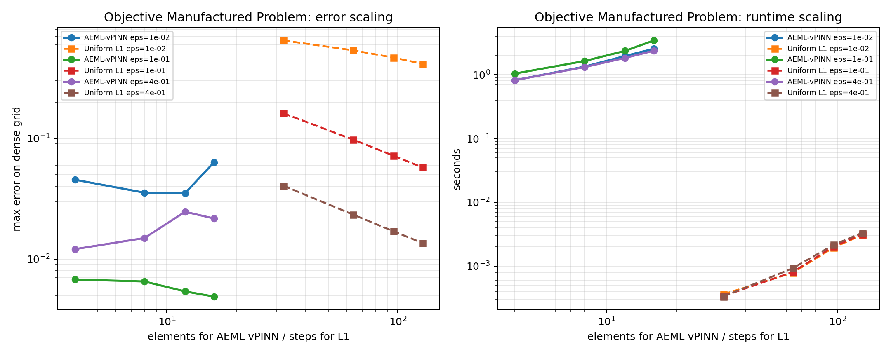
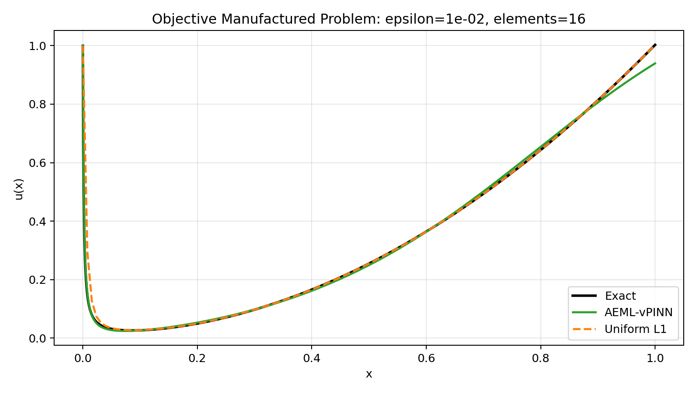

# AEML-vPINN Benchmark: Objective Manufactured Problem

## Configuration

- `alpha = 0.75`
- `epsilons = ['1.0e-02', '1.0e-01', '4.0e-01']`
- `element counts = [4, 8, 12, 16]`
- `quadrature order = 8`
- `dense_points = 3000`

`epsilon D_C^alpha u(x) + u(x) = f(x)`, `u(0)=1`, with exact solution `u(x)=E_alpha(-x^alpha / epsilon) + x^2` and `f(x)=2 epsilon x^(2-alpha) / Gamma(3-alpha) + x^2`.

## AEML-vPINN Error Table

| n_elements | eps=1.0e-02 | eps=1.0e-01 | eps=4.0e-01 |
| ---: | ---: | ---: | ---: |
| 4 | 4.54802e-02 | 6.78130e-03 | 1.20920e-02 |
| 8 | 3.55309e-02 | 6.53057e-03 | 1.49590e-02 |
| 12 | 3.52182e-02 | 5.40319e-03 | 2.46864e-02 |
| 16 | 6.33150e-02 | 4.89709e-03 | 2.17189e-02 |

Raw CSV: [objective_manufactured_aeml_vpinn_sweep.csv](objective_manufactured_aeml_vpinn_sweep.csv)

## Uniform L1 Reference CSV

[objective_manufactured_uniform_l1_reference_sweep.csv](objective_manufactured_uniform_l1_reference_sweep.csv)

## Best AEML-vPINN Per Epsilon

| epsilon | best elements | node count | max error | weak loss | time (s) |
| ---: | ---: | ---: | ---: | ---: | ---: |
| 1.0e-02 | 12 | 96 | 3.52182e-02 | 1.44641e-07 | 1.96560e+00 |
| 1.0e-01 | 16 | 128 | 4.89709e-03 | 7.59830e-08 | 3.43845e+00 |
| 4.0e-01 | 4 | 32 | 1.20920e-02 | 3.44071e-07 | 8.19898e-01 |

## Convergence Plot

## Profile Plot

