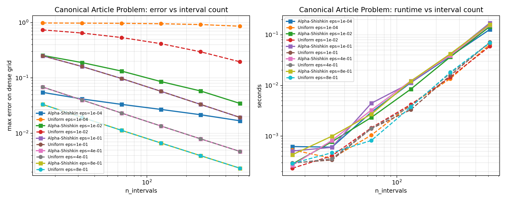
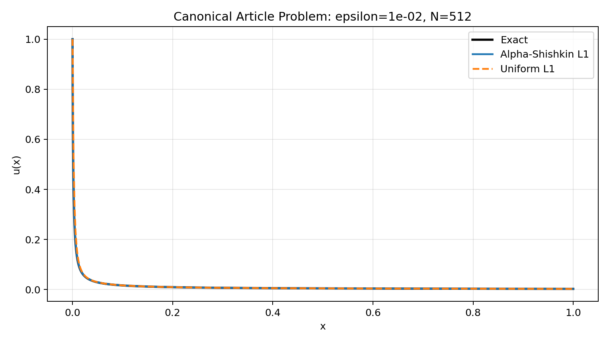

# Alpha-Shishkin L1 Benchmark: Canonical Article Problem

## Configuration

- `alpha = 0.75`
- `epsilons = ['1.0e-04', '1.0e-02', '1.0e-01', '4.0e-01', '8.0e-01']`
- `interval sizes = [16, 32, 64, 128, 256, 512]`
- `M = 4.0`
- `dense_points = 4000`

`epsilon D_C^alpha u(x) + u(x) = 0`, `u(0)=1`, with exact solution `u(x)=E_alpha(-x^alpha / epsilon)`.

## Alpha-Shishkin Error Table

| n_intervals | eps=1.0e-04 | eps=1.0e-02 | eps=1.0e-01 | eps=4.0e-01 | eps=8.0e-01 |
| ---: | ---: | ---: | ---: | ---: | ---: |
| 16 | 5.49879e-02 | 2.55436e-01 | 2.51141e-01 | 6.87370e-02 | 3.33947e-02 |
| 32 | 4.17513e-02 | 1.89545e-01 | 1.61071e-01 | 4.00322e-02 | 1.94130e-02 |
| 64 | 3.33585e-02 | 1.33203e-01 | 9.77301e-02 | 2.32504e-02 | 1.13399e-02 |
| 128 | 2.70310e-02 | 8.60106e-02 | 5.74485e-02 | 1.35572e-02 | 6.69102e-03 |
| 256 | 2.17058e-02 | 5.83270e-02 | 3.33734e-02 | 7.96979e-03 | 3.95884e-03 |
| 512 | 1.68509e-02 | 3.46959e-02 | 1.94117e-02 | 4.71440e-03 | 2.34630e-03 |

Raw CSV: [canonical_alpha_shishkin_l1_sweep.csv](canonical_alpha_shishkin_l1_sweep.csv)

## Uniform Error Table

| n_intervals | eps=1.0e-04 | eps=1.0e-02 | eps=1.0e-01 | eps=4.0e-01 | eps=8.0e-01 |
| ---: | ---: | ---: | ---: | ---: | ---: |
| 16 | 9.83499e-01 | 7.38264e-01 | 2.51141e-01 | 6.87370e-02 | 3.33947e-02 |
| 32 | 9.77394e-01 | 6.47234e-01 | 1.61071e-01 | 4.00322e-02 | 1.94130e-02 |
| 64 | 9.69420e-01 | 5.37006e-01 | 9.77301e-02 | 2.32504e-02 | 1.13399e-02 |
| 128 | 9.53510e-01 | 4.15748e-01 | 5.74485e-02 | 1.35572e-02 | 6.69102e-03 |
| 256 | 9.21817e-01 | 2.97114e-01 | 3.33734e-02 | 7.96979e-03 | 3.95884e-03 |
| 512 | 8.58855e-01 | 1.95880e-01 | 1.94117e-02 | 4.71440e-03 | 2.34630e-03 |

Raw CSV: [canonical_uniform_l1_reference_sweep.csv](canonical_uniform_l1_reference_sweep.csv)

## Best Alpha-Shishkin Per Epsilon

| epsilon | best N | max error | cond | time (s) |
| ---: | ---: | ---: | ---: | ---: |
| 1.0e-04 | 512 | 1.68509e-02 | 3.33901e+01 | 1.27610e-01 |
| 1.0e-02 | 512 | 3.46959e-02 | 3.34258e+01 | 1.45400e-01 |
| 1.0e-01 | 512 | 1.94117e-02 | 8.69582e+01 | 1.71425e-01 |
| 4.0e-01 | 512 | 4.71440e-03 | 7.59412e+02 | 1.56501e-01 |
| 8.0e-01 | 512 | 2.34630e-03 | 2.13217e+03 | 1.60396e-01 |

## Best Uniform Per Epsilon

| epsilon | best N | max error | cond | time (s) |
| ---: | ---: | ---: | ---: | ---: |
| 1.0e-04 | 512 | 8.58855e-01 | 1.02098e+00 | 6.44282e-02 |
| 1.0e-02 | 512 | 1.95880e-01 | 3.09812e+00 | 5.93724e-02 |
| 1.0e-01 | 512 | 1.94117e-02 | 2.19812e+01 | 7.16503e-02 |
| 4.0e-01 | 512 | 4.71440e-03 | 8.49250e+01 | 6.91834e-02 |
| 8.0e-01 | 512 | 2.34630e-03 | 1.68850e+02 | 6.99744e-02 |

## Convergence Plot

## Profile Plot

