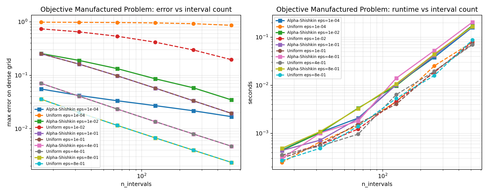
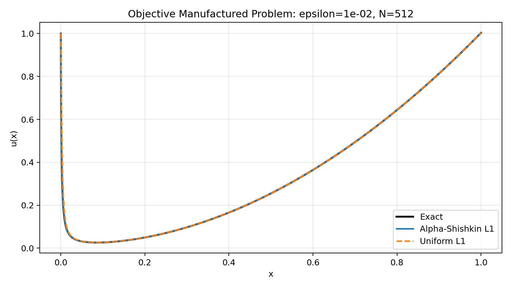

# Alpha-Shishkin L1 Benchmark: Objective Manufactured Problem

## Configuration

- `alpha = 0.75`
- `epsilons = ['1.0e-04', '1.0e-02', '1.0e-01', '4.0e-01', '8.0e-01']`
- `interval sizes = [16, 32, 64, 128, 256, 512]`
- `M = 4.0`
- `dense_points = 4000`

`epsilon D_C^alpha u(x) + u(x) = f(x)`, `u(0)=1`, with exact solution `u(x)=E_alpha(-x^alpha / epsilon) + x^2` and `f(x)=2 epsilon x^(2-alpha) / Gamma(3-alpha) + x^2`.

## Alpha-Shishkin Error Table

| n_intervals | eps=1.0e-04 | eps=1.0e-02 | eps=1.0e-01 | eps=4.0e-01 | eps=8.0e-01 |
| ---: | ---: | ---: | ---: | ---: | ---: |
| 16 | 5.54124e-02 | 2.55439e-01 | 2.52574e-01 | 7.07502e-02 | 3.57854e-02 |
| 32 | 4.19021e-02 | 1.89547e-01 | 1.61489e-01 | 4.05699e-02 | 2.01123e-02 |
| 64 | 3.34150e-02 | 1.33203e-01 | 9.78475e-02 | 2.33907e-02 | 1.15749e-02 |
| 128 | 2.70511e-02 | 8.60108e-02 | 5.74804e-02 | 1.35934e-02 | 6.75645e-03 |
| 256 | 2.17120e-02 | 5.83270e-02 | 3.33820e-02 | 7.98582e-03 | 3.97561e-03 |
| 512 | 1.68530e-02 | 3.46960e-02 | 1.94139e-02 | 4.71858e-03 | 2.35052e-03 |

Raw CSV: [objective_manufactured_alpha_shishkin_l1_sweep.csv](objective_manufactured_alpha_shishkin_l1_sweep.csv)

## Uniform Error Table

| n_intervals | eps=1.0e-04 | eps=1.0e-02 | eps=1.0e-01 | eps=4.0e-01 | eps=8.0e-01 |
| ---: | ---: | ---: | ---: | ---: | ---: |
| 16 | 9.83530e-01 | 7.38749e-01 | 2.52574e-01 | 7.07502e-02 | 3.57854e-02 |
| 32 | 9.77402e-01 | 6.47395e-01 | 1.61489e-01 | 4.05699e-02 | 2.01123e-02 |
| 64 | 9.69424e-01 | 5.37060e-01 | 9.78475e-02 | 2.33907e-02 | 1.15749e-02 |
| 128 | 9.53512e-01 | 4.15765e-01 | 5.74804e-02 | 1.35934e-02 | 6.75645e-03 |
| 256 | 9.21818e-01 | 2.97119e-01 | 3.33820e-02 | 7.98582e-03 | 3.97561e-03 |
| 512 | 8.58855e-01 | 1.95881e-01 | 1.94139e-02 | 4.71858e-03 | 2.35052e-03 |

Raw CSV: [objective_manufactured_uniform_l1_reference_sweep.csv](objective_manufactured_uniform_l1_reference_sweep.csv)

## Best Alpha-Shishkin Per Epsilon

| epsilon | best N | max error | cond | time (s) |
| ---: | ---: | ---: | ---: | ---: |
| 1.0e-04 | 512 | 1.68530e-02 | 3.33901e+01 | 1.61196e-01 |
| 1.0e-02 | 512 | 3.46960e-02 | 3.34258e+01 | 1.75003e-01 |
| 1.0e-01 | 512 | 1.94139e-02 | 8.69582e+01 | 1.65235e-01 |
| 4.0e-01 | 512 | 4.71858e-03 | 7.59412e+02 | 2.05073e-01 |
| 8.0e-01 | 512 | 2.35052e-03 | 2.13217e+03 | 1.67555e-01 |

## Best Uniform Per Epsilon

| epsilon | best N | max error | cond | time (s) |
| ---: | ---: | ---: | ---: | ---: |
| 1.0e-04 | 512 | 8.58855e-01 | 1.02098e+00 | 7.90262e-02 |
| 1.0e-02 | 512 | 1.95881e-01 | 3.09812e+00 | 8.03500e-02 |
| 1.0e-01 | 512 | 1.94139e-02 | 2.19812e+01 | 7.25885e-02 |
| 4.0e-01 | 512 | 4.71858e-03 | 8.49250e+01 | 6.97053e-02 |
| 8.0e-01 | 512 | 2.35052e-03 | 1.68850e+02 | 8.74285e-02 |

## Convergence Plot

## Profile Plot

