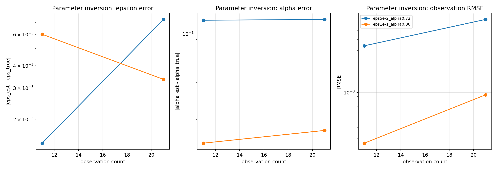
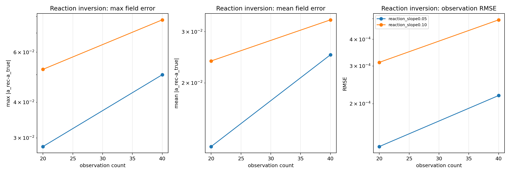

# Inverse AEML-vPINN Benchmark

## Configuration

- `parameter observation counts = [11, 21]`
- `reaction observation counts = [20, 40]`
- `parameter data weight = 250.0`
- `reaction data weight = 200.0`

## Parameter Inversion RMSE Table

| case | Nobs=11 | Nobs=21 |
| ---: | ---: | ---: |
| eps5e-2_alpha0.72 | 3.37670e-03 | 6.71530e-03 |
| eps1e-1_alpha0.80 | 2.66832e-04 | 9.41452e-04 |

Raw CSV: [inverse_parameter_identification_sweep.csv](inverse_parameter_identification_sweep.csv)

## Best Parameter-Inversion Runs

| case | best Nobs | |eps err| | |alpha err| | RMSE | time (s) |
| ---: | ---: | ---: | ---: | ---: | ---: |
| eps5e-2_alpha0.72 | 11 | 1.46693e-03 | 1.29340e-01 | 3.37670e-03 | 4.43276e+01 |
| eps1e-1_alpha0.80 | 11 | 6.02120e-03 | 1.28267e-02 | 2.66832e-04 | 1.04925e+02 |

## Reaction Inversion Error Table

| case | Nobs=20 | Nobs=40 |
| ---: | ---: | ---: |
| reaction_slope0.05 | 2.79686e-02 | 4.99845e-02 |
| reaction_slope0.10 | 5.22192e-02 | 7.79056e-02 |

Raw CSV: [inverse_reaction_field_sweep.csv](inverse_reaction_field_sweep.csv)

## Best Reaction-Inversion Runs

| case | best Nobs | max field err | mean field err | RMSE | time (s) |
| ---: | ---: | ---: | ---: | ---: | ---: |
| reaction_slope0.05 | 20 | 2.79686e-02 | 1.20781e-02 | 1.25965e-04 | 8.72464e-01 |
| reaction_slope0.10 | 20 | 5.22192e-02 | 2.37953e-02 | 3.12226e-04 | 1.21996e+00 |

## Parameter Plot

## Reaction Plot

