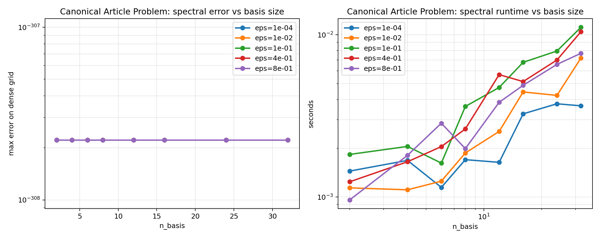
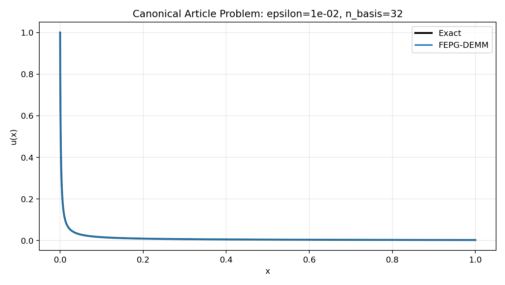

# Spectral Benchmark: Canonical Article Problem

## Configuration

- `alpha = 0.75`
- `epsilons = ['1.0e-04', '1.0e-02', '1.0e-01', '4.0e-01', '8.0e-01']`
- `basis sizes = [2, 4, 6, 8, 12, 16, 24, 32]`
- `dense_points = 4000`

`epsilon D_C^alpha u(x) + u(x) = 0`, `u(0)=1`, with exact solution `u(x)=E_alpha(-x^alpha / epsilon)`.

## Error Table

| n_basis | eps=1.0e-04 | eps=1.0e-02 | eps=1.0e-01 | eps=4.0e-01 | eps=8.0e-01 |
| ---: | ---: | ---: | ---: | ---: | ---: |
| 2 | 0.00000e+00 | 0.00000e+00 | 0.00000e+00 | 0.00000e+00 | 0.00000e+00 |
| 4 | 0.00000e+00 | 0.00000e+00 | 0.00000e+00 | 0.00000e+00 | 0.00000e+00 |
| 6 | 0.00000e+00 | 0.00000e+00 | 0.00000e+00 | 0.00000e+00 | 0.00000e+00 |
| 8 | 0.00000e+00 | 0.00000e+00 | 0.00000e+00 | 0.00000e+00 | 0.00000e+00 |
| 12 | 0.00000e+00 | 0.00000e+00 | 0.00000e+00 | 0.00000e+00 | 0.00000e+00 |
| 16 | 0.00000e+00 | 0.00000e+00 | 0.00000e+00 | 0.00000e+00 | 0.00000e+00 |
| 24 | 0.00000e+00 | 0.00000e+00 | 0.00000e+00 | 0.00000e+00 | 0.00000e+00 |
| 32 | 0.00000e+00 | 0.00000e+00 | 0.00000e+00 | 0.00000e+00 | 0.00000e+00 |

## Best Per Epsilon

| epsilon | best n_basis | max error | cond | time (s) |
| ---: | ---: | ---: | ---: | ---: |
| 1.0e-04 | 2 | 0.00000e+00 | 5.97251e+01 | 1.44580e-03 |
| 1.0e-02 | 2 | 0.00000e+00 | 6.06260e+01 | 1.13890e-03 |
| 1.0e-01 | 2 | 0.00000e+00 | 6.90336e+01 | 1.83100e-03 |
| 4.0e-01 | 2 | 0.00000e+00 | 1.00061e+02 | 1.24200e-03 |
| 8.0e-01 | 2 | 0.00000e+00 | 1.50050e+02 | 9.60700e-04 |

Raw CSV: [canonical_spectral_sweep.csv](canonical_spectral_sweep.csv)

## Convergence Plot

## Profile Plot

