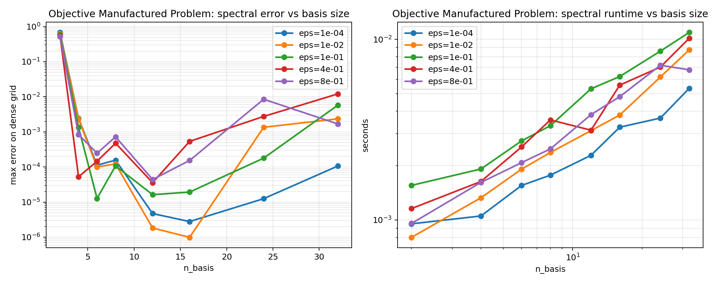
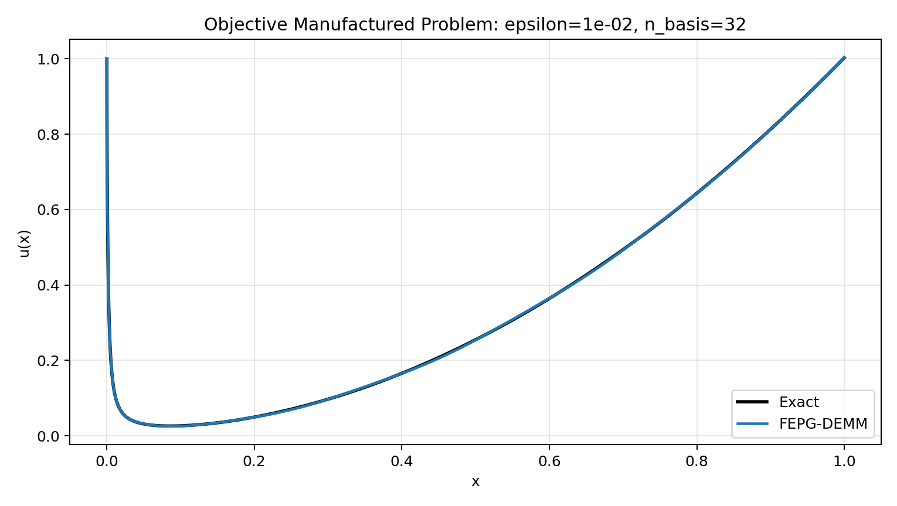

# Spectral Benchmark: Objective Manufactured Problem

## Configuration

- `alpha = 0.75`
- `epsilons = ['1.0e-04', '1.0e-02', '1.0e-01', '4.0e-01', '8.0e-01']`
- `basis sizes = [2, 4, 6, 8, 12, 16, 24, 32]`
- `dense_points = 4000`

`epsilon D_C^alpha u(x) + u(x) = f(x)`, `u(0)=1`, with exact solution `u(x)=E_alpha(-x^alpha / epsilon) + x^2` and `f(x)=2 epsilon x^(2-alpha) / Gamma(3-alpha) + x^2`.

## Error Table

| n_basis | eps=1.0e-04 | eps=1.0e-02 | eps=1.0e-01 | eps=4.0e-01 | eps=8.0e-01 |
| ---: | ---: | ---: | ---: | ---: | ---: |
| 2 | 6.81022e-01 | 6.22046e-01 | 5.90799e-01 | 5.46891e-01 | 5.20178e-01 |
| 4 | 2.41276e-03 | 2.28765e-03 | 1.33364e-03 | 5.23755e-05 | 8.33458e-04 |
| 6 | 1.12525e-04 | 1.00073e-04 | 1.26941e-05 | 1.46046e-04 | 2.46989e-04 |
| 8 | 1.56265e-04 | 1.22153e-04 | 1.07112e-04 | 4.75161e-04 | 7.22202e-04 |
| 12 | 4.69914e-06 | 1.82435e-06 | 1.62351e-05 | 3.56699e-05 | 4.38738e-05 |
| 16 | 2.78212e-06 | 9.88027e-07 | 1.92459e-05 | 5.35086e-04 | 1.53081e-04 |
| 24 | 1.24904e-05 | 1.35112e-03 | 1.78255e-04 | 2.75034e-03 | 8.48471e-03 |
| 32 | 1.05890e-04 | 2.35112e-03 | 5.72218e-03 | 1.20375e-02 | 1.68345e-03 |

## Best Per Epsilon

| epsilon | best n_basis | max error | cond | time (s) |
| ---: | ---: | ---: | ---: | ---: |
| 1.0e-04 | 16 | 2.78212e-06 | 1.25568e+01 | 3.26290e-03 |
| 1.0e-02 | 16 | 9.88027e-07 | 4.99978e+02 | 3.80840e-03 |
| 1.0e-01 | 6 | 1.26941e-05 | 5.08413e+03 | 2.73830e-03 |
| 4.0e-01 | 12 | 3.56699e-05 | 3.25482e+17 | 3.14000e-03 |
| 8.0e-01 | 12 | 4.38738e-05 | 1.34068e+23 | 3.82590e-03 |

Raw CSV: [objective_manufactured_spectral_sweep.csv](objective_manufactured_spectral_sweep.csv)

## Convergence Plot

## Profile Plot

